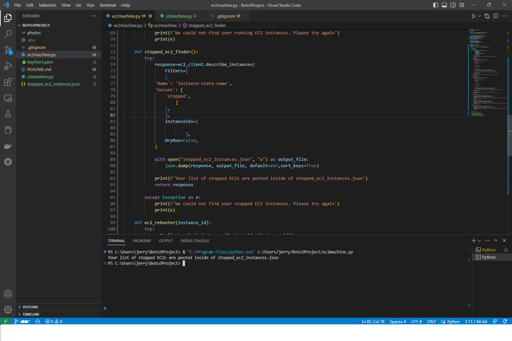
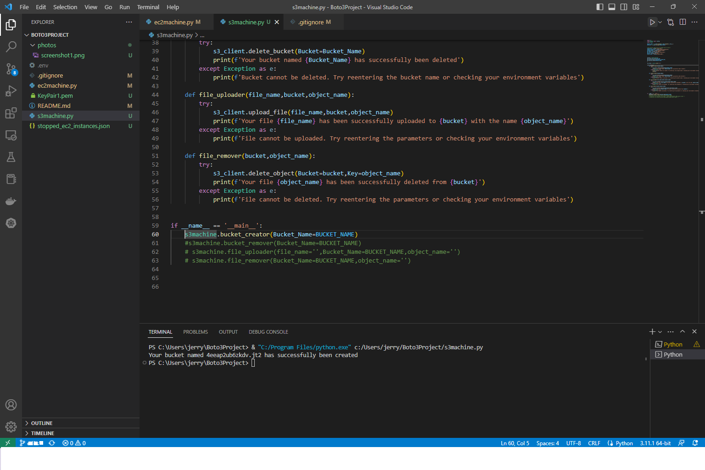
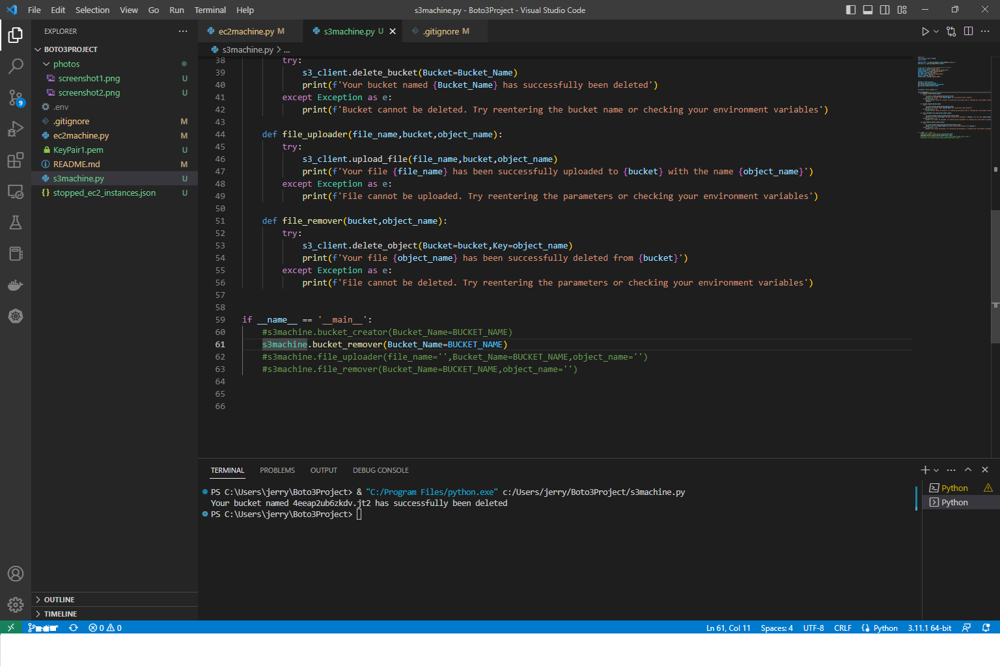
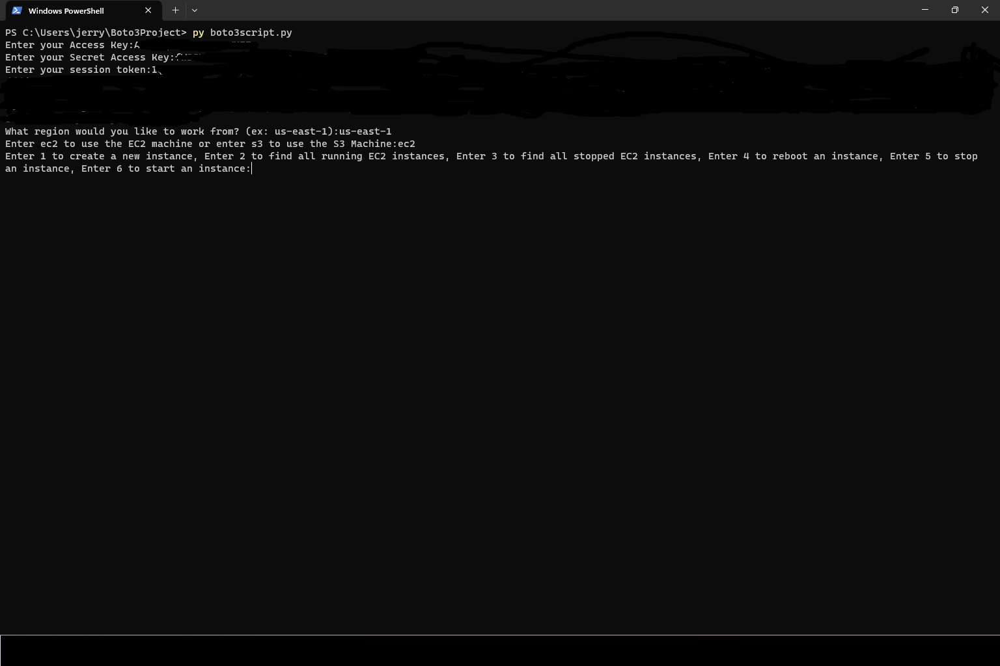

 

## This README file contains:
-Purpose of the project  
-Project Instructions  
## Project Purpose:

With all the complexities surrounding AWS resources, completing rudimentary AWS tasks, such as uploading a file to an S3 bucket or launching an EC2 instance, can appear daunting to new cloud professionals. 

This project introduces a simple, programmatic solution to navigating the labyrinth of configurations for two of the most common AWS resources (S3 & EC2) with a pipeline that <b>uploads</b> objects to an S3 bucket (fileupload.py) and a Python file that automatically <b> builds </b> and <b>starts</b> an Amazon EC2 Instance with the ability to shut down the created EC2 Instance (ec2machine.py).  

## Instructions:

1. Ensure you are connected to the internet.

2. Ensure your environment variables are properly configured (SESSION_TOKEN must be up to date).

3. To create/start/stop an EC2 instance, run ec2machine.py.

4. To upload an object or file to a specified S3 bucket.

 

## Project Photos:

